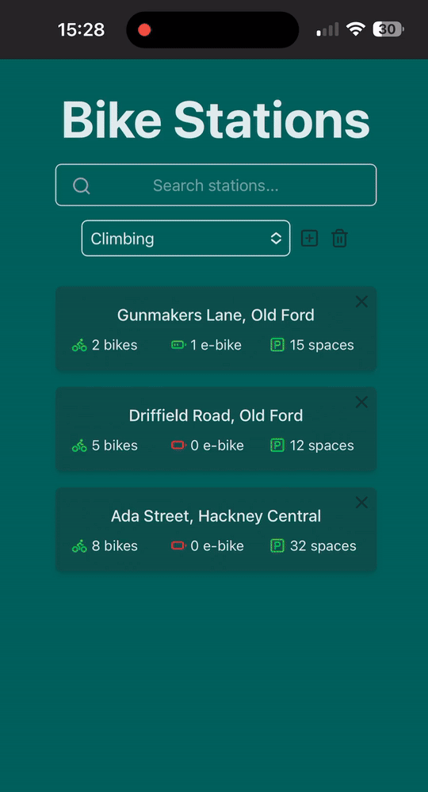

<div align="center">


<h2> Project Name : Velock </h2>



</div>

## 💡 Overview

<!--TODO: video demonstration-->

Velock is a web application designed to simplify looking up availability data
for Santander Bikes. Leveraging the TfL Open API, Velock provides
up-to-the-minute availability data for bikes and docking stations across the
city. Users can create personalised lists of frequently used stations for quick
access. Additionally, Velock offers powerful search functionality, allowing
users to locate specific stations or discover nearby docking options based on an
address. Key features include:

## ✨ Features

- 🚲 Real-Time Bike & Dock Availability: Get up-to-the-minute data from the TfL
  Open API.
- 📍 Personalized Station Lists: Create and manage custom lists of favorite
  docking stations for quick access.
- 🔍 Powerful Station Search: Find specific docking stations by name or
  location.
- 🗺️ Location-Based Nearby Station Retrieval: Retrieve lists of docking stations
  closest to a specified address.
- ⚡️ Fast Data Retrieval: Designed for efficient and rapid access to bike and
  docking station information.
- 📱 Mobile-First Design: Optimized for seamless use on mobile devices.

## 💻 Tech Stack

- TypeScript: A strongly typed programming language that builds on JavaScript.
- React: A JavaScript library for building user interfaces.
- Node.js: A JavaScript runtime environment for server-side development.
- Express.js: A fast, unopinionated, minimalist web framework for Node.js.
- PostgreSQL: A powerful, open-source relational database system.
- Prisma ORM: A next-generation Node.js and TypeScript ORM.
- bcrypt: A library for hashing passwords.
- JWT (JSON Web Tokens): For secure authentication.
- Passport.js: Authentication middleware for Node.js.
- Tailwind CSS: A utility-first CSS framework.

## 📦 Getting Started

To get a local copy of this project up and running, follow these steps.

### 🛠️ Installation

1. **Clone the repository:**

   ```bash
   git clone git@github.com:Portavion/velock.git
   ```

2. **Install dependencies for frontend and backend:**

   Using Npm:

   ```bash
   npm install
   ```

   Install the postGIS extension for PostgreSQL. This is used for identifying
   the closest docking stations near an address.

3. **Set up environment variables:**

   3.1 Frontend

   ```js
   VITE_BASE_URL = "http://localhost:3000";
   ```

   3.2 Backend

   ```js
   DATABASE_URL = "your_postgre_db_url";
   SECRET_KEY = "your_secret_key_for_bcrypt";
   REFRESH_RATE = your_tfl_bike_point_refresh_rate;
   ```

4. **Start the development server:**

   Run prisma migration to setup the database.

   Backend server can be started with:

   ```bash
   npm run start
   ```

   Frontend server can be started with:

   ```bash
   npm run dev
   ```
